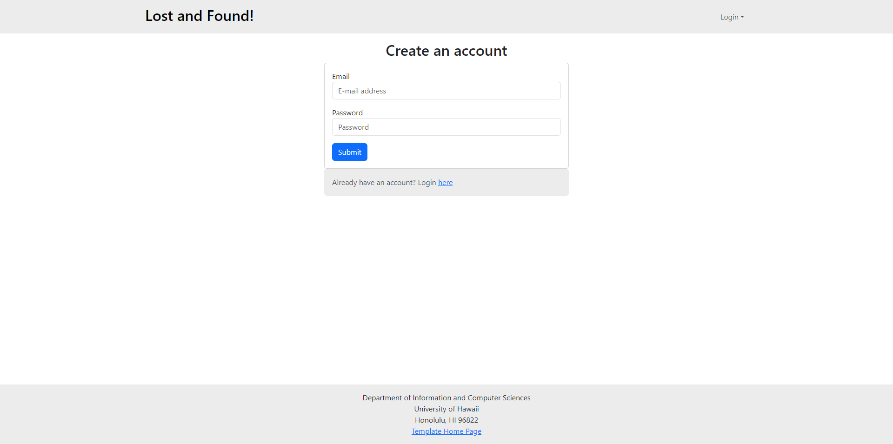
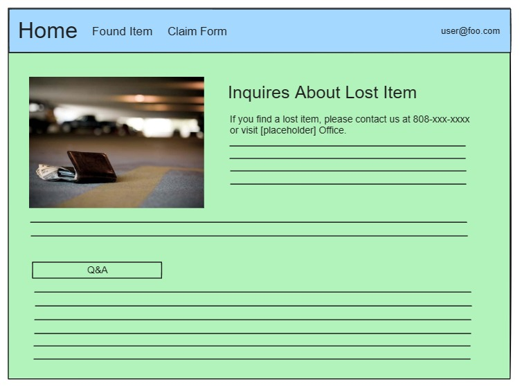

# Where's My Item?

## Table of contents

* [Overview](#overview)
* [Goals](#goals)
* [System](#system)
* [User Guide](#user-guide)
* [Team](#team)

## Overview

## Goals

Provide a site for students to report that they’ve lost something, or report an item that they’ve found.

## System

* Page where you can report a missing item
* Picture (if possible)
* Item description
* Name
* Contact information
* Page where you can report you’ve found a lost item
* Picture
* Item description
* Name
* Contact information
* Where it was found
* Login page for UH Manoa student accounts
* Page where you can access all items lost (so you can see if something you’ve lost is there already)
* Edit items
* Option to delete items that you’ve reported/found if returned to owner

## Team

https://docs.google.com/document/d/15k7QCJ0w4ZB97Gaa42dbeFSXAgJNJC7keOgySTGZSys/edit?usp=sharing

## Walkthrough

#### User login and signup page

A simple mock-up of the login and singup page:

This allows users of the website to create accounts and access user-to-user specific information.

#### User (after Login) page, non-Admin user

Once you log in (either to an existing account or by creating a new one), the navbar changes as follows:

You can now access the lost item submission form, the lost item list, and the claim form.

