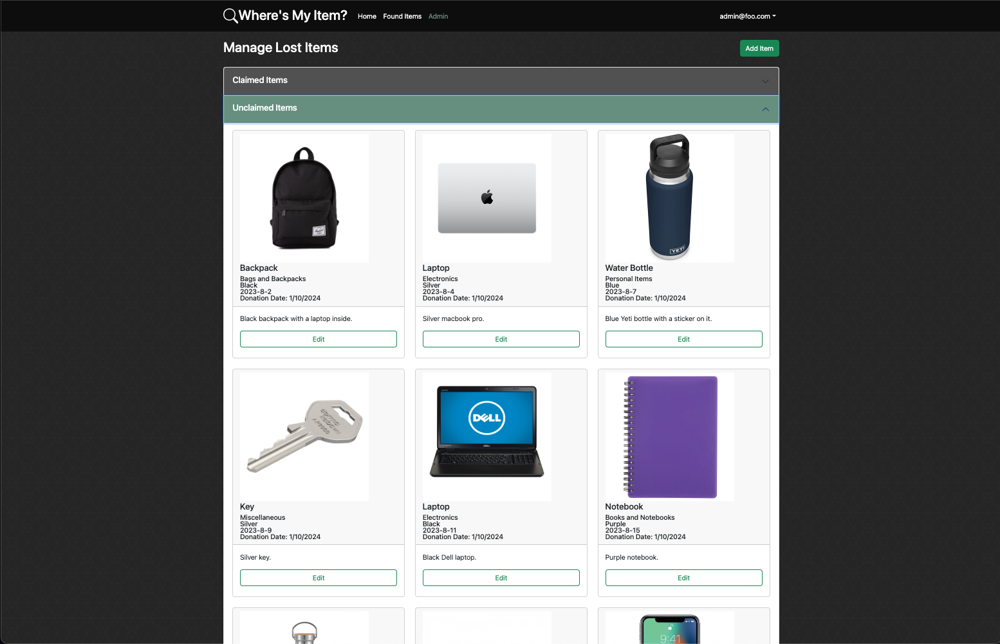
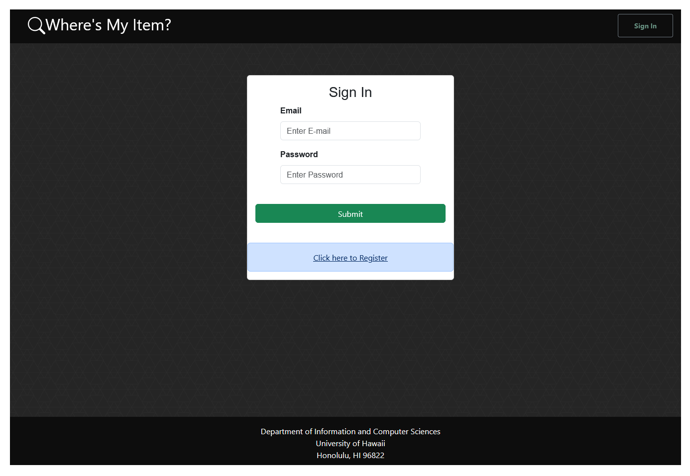
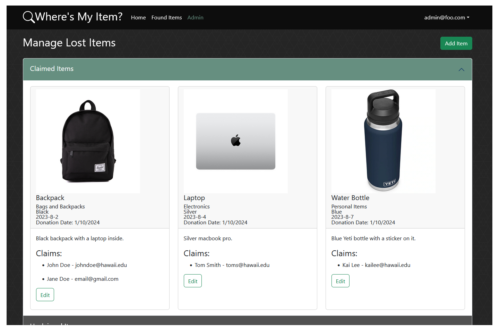

# Where's My Item?


## Table of contents

* [Overview](#overview)
* [Goals](#goals)
* [System](#system)
* [User Guide](#user-guide)
* [Deployment](#deployment)
* [Community Feedback](#community-feedback)
* [Developer Guide](#developer-guide)
* [Development History](#development-history)
* [Team](#team)

## Overview

'Where's My Item?' is a site designed to allow the UH Manoa Lost Item office to list the many lost items that have been found on campus. Students who have lost something can search the site to look to see if they have something that belongs to them, and file a claim for that item if so. Admin can then verify their claim's authenticity using the information provided to them in a claim form.

The site in itself uses:
- Meteor for Javascript-based implementation of client and server code
- React for component-based UI implementation and routing
- React Bootstrap CSS Framework for UI design

The site contains:
* A landing page that informs new users of the purpose of the site, and prompts them to log-in or sign-up to browse the lost items database.
* A "Found Items" page that shows all the lost items in the database, which users can browse for their own lost item.
  * Each item has pertinent descriptions, such as when it was found, what type of item it is, color, and a basic description.
  * Each item has the option to "Claim This Item". Upon selection, it will take them to a "Claim Item" form where they can submit information that they can use to verify their ownership of the item and their contact information.
* An 'Admin' page that is only available to accounts with admin privileges. Here, there are two sections, "Claimed Items" and "Unclaimed Items".
  * "Claimed Items" contains items that users have submitted a claim form for, where they can go to verify their identity and decide whether to accept the claim.
  * "Unclaimed Items" contains all the items in the database with no claims submitted for it yet.
  * All items have an "Edit" button that can be used to edit the item in the database.
  * Admins also have the option called "Add Item", where they can use an "Add Stuff" form to add a new item to the database.
* A Log-In and Sign-Up page for users to login or create accounts, which is necessary before they can submit items.
  * This adds to a collection that consists of user accounts, which have fields for the username, password, whether it has admin priveleges, etc.

## Goals

To provide a site for the UH Manoa Lost Item office to list their collection of lost items that have been turned into them, and for students to view said collection to determine if something they've lost is there, and if so, to submit a claim to get back said item.

## Deployment

We used Digital ocean to deploy our web application.

You can view our deployed application <a href="https://uh-manoa-lost-and-found.online/">here</a>!

## User Guide

This section provides information of interest to users of the system.

<div class="center"></div>

Accessing the site show a basic introduction to the site, and prompts the user to login or sign up. Click the Sign In button at the top right corner to log in, or sign up for a new account.

<div class="center"></div>

For both the sign in and sign up pages, enter your email and password, and click the appropriate button.

<div class="center"></div>

After logging in, you will be taken to the home page. The navbar will change to include a link to the Found Items page, and a link to the Claim Form page. The navbar will also include a link to the Admin page if you are an admin user. Clicking your username followed by the Sign Out button will log you out and take you back to the landing page. Each category on the Home page has a dropdown menu that can be accessed by clicking the correlating arrow. Clicking the arrow again will close the dropdown menu.

<div class="center"></div>

Clicking the Found Items link in the navbar will take you to the Found Items page. Here you can view all the items that have been found. You can filter the items by category or color by clicking on the Filter button. You can also sort items by date posted, in either ascending or descending order. Clicking the Claim This Item link at the bottom of each item card will take you to the Claim Form page.

<div class="center"></div>

The Claim Form page will show the item you are attempting to claim. Fill out the form with your contact information and details about the item. The more detailed the form claim is, the more likely it is that you will be identified as the item's owner. Click the Submit button to submit your claim. You can also upload an image of the item if you have one:

<div class="center"></div>

Clicking Choose File will open a file explorer where you can select an image to upload. Clicking the Upload button will upload the image to the database. The submit button will not work while the image is being uploaded. Once the image has been uploaded, the submit button will work again.

<div class="center"></div>

If you are an admin user, you will have access to the Admin page. Here you can view all the items in the database. Items with claims will be in the Claimed Items section, and items without claims will be in the Unclaimed Items section. Clicking the View Claims button will show the claims for that item. Clicking the Edit button will take you to the Edit Item page for that item. Clicking the Delete button will delete the item from the database. Clicking the Add Item button will take you to the Add Item page.


#### Landing Page

Landing page for users accessing the site without an account:

<div class="center"></div>

Provides information regarding the functionality of the site to the user, and prompts them to login/sign up.

#### User login and signup page

A simple login and singup page:

<div class="center"></div>

<div class="center"></div>

This allows users of the website to create accounts and access user specific information.

#### User (after Login) page, non-Admin user

Once you log in (either to an existing account or by creating a new one), the navbar changes as follows:

<div class="center"></div>

You can now access the lost item list and the claim form.

#### Found Items page

Following the navbar link to Found Items will bring you to the page listing all the items that have been found:

<div class="center"></div>

The items are listed in cards, with images and details. There is also an option to filter (e.g. by category) and to sort (e.g. by date posted). At the bottom of each item card is a link to claim the item. This link leads to the claim form.

#### Claim Form page

The claim form page can be accessed by clicking the link at the bottom of each item card on the Found Items page.

<div class="center"></div>

The claim form page includes the card of the item being claimed. It also has a form for the user to fill in, with their contact information and details about the item. The user can also add a comment. There is also an option to view pending claims.

#### Admin page

The admin page can be accessed after logging in as an admin user, using the navbar.

<div class="center"></div>

The page allow you to view all lost items, along with their details. There are two rows of item cards, those with claims and those without claims. Each row is contained in a collapsable container to reduce screen clutter if there are many items.


#### Admin Add/Edit page

The add and edit item pages can be accessed from the admin page. There is a single button to add an item. Each item card has an edit link.

<div class="center"></div>

These pages allow the admin to create/edit an item's image, name, location found, and description. The edit page has an aditional button to delete the item in the case that it was mistakenly added or has been returned to the owner.

## Community Feedback

We asked five different students from UH Manoa outside of our ICS 314 class to provide feedback for the site. Critique was received and split into four separate parts for better analysis, which include the aesthetics of the site, its functionality/ease of use, how well it achieves its purpose, and possible improvements to it.

### Aesthetics

After looking at all the feedback received, it seems that there was somewhat of a split between the students we asked as to whether the site having a more dark aesthetic was good or bad. Most said that the site being in "dark mode' was better on their eyes, and some thought that the site had an almost "cozy" feel (thought I think that was mostly because of the picture of a campus in the middle of fall). Others thought that the site having primarily darker colors made it look unprofessional. 

As for other parts of the site, there seemed to be a consensus that although the site looked nice to them, it did seem a bit obvious that students had made the site, i.e. there was an "amateur" feel to it. 

Despite this, most said that it didn't feel too crowded/noisy, and that information was displayed in a balanced manner. One exception was the "Found Items" page, as someone said that it would've looked nicer if all the lost items weren't displayed on the same page, and was instead spread out across several pages, with a max amount displayed on a single page and a way to hit "next page" and go to the next 9 or so items in the database. Another said that the size of the cards for the lost items should be smaller, since they didn't think it was necessary for one item to take up so much space on the page.

### Functionality/Ease of Use

Most said that the site was easy to use and navigate, however one was confused why the "Home" page was labeled that and not something like "FAQ" or "About", and as mentioned above, navigating the "Found Items" page would be easier if there was a max limit to how many items appeared on the page.

There also seemed to be some confusion on some of the mechanics of site, such as what the difference between claimed and unclaimed items were on the "Admin" page, although that was quickly cleared up with an explanation. Still, it's important to note it wasn't immediately obvious to them. 

Another said that the "Sign-out" option would work better if it immediately loaded the landing page after a successful sign-out instead of loading a page with a "You are signed out" message, as most modern sites do. They said that it made it a bit clunky to use.

Other than that, confusion was minimal and most said everything generally worked as expected.

### Purpose

Feedback was received throughout the week leading up to the due date of the project, and so not everything was implemented yet. As such, it was necessary to explain the mechanics of how the site would notify the user that their claim was verified and to go pick up their item from the Lost Item office, as well as how the admin verifies and deletes the claims to clarify how the site would achieve its goal. 

After the explanation, most said that the site worked at the very least on a basic level. Users could see what the Lost Item office had in store, file a claim form, and get notification when an admin got back to them and verified their claim. That's basically all it had to do.

### Improvements

Most suggestions for how to improve the site were vague, and suggested improving how professional the site looked and adding tweaks to make the site feel better to use.

Concrete suggestions were mentioned above, and include signing out immediately loading the landing page, there being a max amount of items listed on a single page in the "Found Items" page so they wouldn't have to keep scrolling and it wouldn't be so easy to lose their place on the page, and another said to include some sort of transition graphics to make everything feel smoother when navigating through the site.


## Developer Guide

This section provides information of interest to Meteor developers wishing to use this code base as a basis for their own development tasks.

### Installation

First, [install Meteor](https://www.meteor.com/install).

Second, visit the [our application github page](https://github.com/wheres-my-item/project), and click the "Use this template" button to create your own repository initialized with a copy of this application. Alternatively, you can download the sources as a zip file or make a fork of the repo.  However you do it, download a copy of the repo to your local computer.

Third, cd into the project/app directory and install libraries with:

```
$ meteor npm install
```

Fourth, run the system with:

```
$ meteor npm run start
```

If all goes well, the application will appear at [http://localhost:3000](http://localhost:3000).

### Application Design

This project is based upon [meteor-application-template-react](https://ics-software-engineering.github.io/meteor-application-template-react/) and [meteor-example-form-react](https://ics-software-engineering.github.io/meteor-example-form-react/). Please use the videos and documentation at those sites to better acquaint yourself with the basic application design.

### Data Model

Our website contains collections for the user accounts, with fields such as the name of the email, password, and role, the lost items, with fields for the description of the item, and for the claims, with fields describing who is attempting to claim the lost item and proof that they owned it. The claim form links back to the item that the user is attempting to claim.

### Initialization

The config directory is intended to hold settings files. The repository contains one file: config/settings.development.json.

This file contains default definitions for the user accounts, the lost items in the database, and the user claims for a particular item, and the relationships between them.

### Quality Assurance

#### ESLint

The project includes a .eslintrc file to define the coding style adhered to in this application. You can invoke ESLint from the command line as follows:
 
```
meteor npm run lint
```

Here is sample output indicating that no ESLint errors were detected:

```
$ meteor npm run lint

> project@ lint /Users/philipjohnson/github/wheres-my-item/project/app
> eslint --quiet --ext .jsx --ext .js ./imports ./tests

$
```

ESLint should run without generating any errors.

It's significantly easier to do development with ESLint integrated directly into your IDE (such as IntelliJ).

#### End to End Testing

Wheres-my-item uses [TestCafe](https://devexpress.github.io/testcafe/) to provide automated end-to-end testing.

The wheres-my-item end-to-end test code employs the page object model design pattern.  In the [project tests/ directory](https://github.com/wheres-my-item/project/tree/main/app/tests), the file [tests.testcafe.js](https://github.com/wheres-my-item/project/blob/main/app/tests/tests.testcafe.js) contains the TestCafe test definitions. The remaining files in the directory contain "page object models" for the various pages in the system (i.e. Home, Landing, Interests, etc.) as well as one component (navbar). This organization makes the test code shorter, easier to understand, and easier to debug.

To run the end-to-end tests in development mode, you must first start up a wheres-my-item instance by invoking `meteor npm run start` in one console window.

Then, in another console window, start up the end-to-end tests with:

```
meteor npm run testcafe
```

You will see browser windows appear and disappear as the tests run.  If the tests finish successfully, you should see the following in your second console window:

```
PS C:\Users\name\github\project\app> meteor npm run testcafe       

> meteor-application-template-react@ testcafe C:\Users\name\github\project\app
> testcafe chrome tests/*.testcafe.js

 Running tests in:
 - Chrome 119.0.0.0 / Windows 11

 meteor-application-template-react localhost test with default db
 √ Test that landing page shows up
 √ Test that signin and signout work


 2 passed (17s)
```

All the tests pass, but the first test is marked as "unstable". At the time of writing, TestCafe fails the first time it tries to run a test in this mode, but subsequent attempts run normally. To prevent the test run from failing due to this problem with TestCafe, we enable [testcafe quarantine mode](https://devexpress.github.io/testcafe/documentation/guides/basic-guides/run-tests.html#quarantine-mode).

The only impact of quarantine mode should be that the first test is marked as "unstable".

### From Mockup to Production

One additional security-related change that was implemented was the use of https so that the information that flows between the server and the browser is encrypted, which includes confidential information such as logins and passwords.

### Continuous Integration


This site uses GitHub Actions to automatically run ESLint and TestCafe each time a commit is made to the default branch. You can see the results of all recent “workflows” at https://github.com/wheres-my-item/project/actions.

The workflow definition file is located at .github/workflows/ci.yml. 

## Development History

The development process for our website, Where's My Item, conformed to Issue Driven Project Management practices. In short:

* Development consists of a sequence of Milestones.
* Each Milestone is specified as a set of tasks.
* Each task is described using a GitHub Issue, and is assigned to a single developer to complete.
* Tasks should typically consist of work that can be completed in 2-4 days.
* The work for each task is accomplished with a git branch named “issue-XX”, where XX is replaced by the issue number.
* When a task is complete, its corresponding issue is closed and its corresponding git branch is merged into master.
* The state (todo, in progress, complete) of each task for a milestone is managed using a GitHub Project Board.

The following sections document the development history of our project.

### Milestone 1 : Mockups and Initial Page Deployment

Our goal for Milestone 1 was to create our home page, with mockups of what our final website should look like, and an initial deployment of our website with a landing page.

Milestone 1 was managed with [Our GitHub Project Board M1](https://github.com/orgs/wheres-my-item/projects/1):


### Milestone 2 : Functionality and Quality

Our goal for Milestone 2 was to work on the functionality and quality of our website, specifically making sure each of our pages work as intended.

Milestone 2 was managed with [Our GitHub Project Board M2](https://github.com/orgs/wheres-my-item/projects/3):


### Milestone 3 : Functionality and Design

Our goal for Milestone 3 was to further work on the functionality of the website, finishing any unfinished pages from the Milestone 2. In addition to this, we focused on the design and stylization elements of our site. We also asked for community feedback to further improve our project.

Milestone 3 was managed with [Our GitHub Project Board M4](https://github.com/orgs/wheres-my-item/projects/4/views/1):


## Team

#### Project Team Member:
- Dao McGill       | dmcgill@hawaii.edu   | [GitHub Profile](https://github.com/daomcgill)
- Michael Nakagawa | mnakaga4@hawaii.edu  | [GitHub Profile](https://github.com/mnakagawa14)
- Riki Macmillan   | rikimacm@hawaii.edu  | [GitHub Profile](https://github.com/rikimacmillan)
- Sean Umeda       | sumeda21@hawaii.edu  | [GitHub Profile](https://github.com/Sumeda21)
- Tiffany Ngo      | ngotiff@hawaii.edu   | [GitHub Profile](https://github.com/tiffany-ngo)

Take a look at our <a href="https://docs.google.com/document/d/15k7QCJ0w4ZB97Gaa42dbeFSXAgJNJC7keOgySTGZSys/edit?usp=sharing">team contract</a>.


