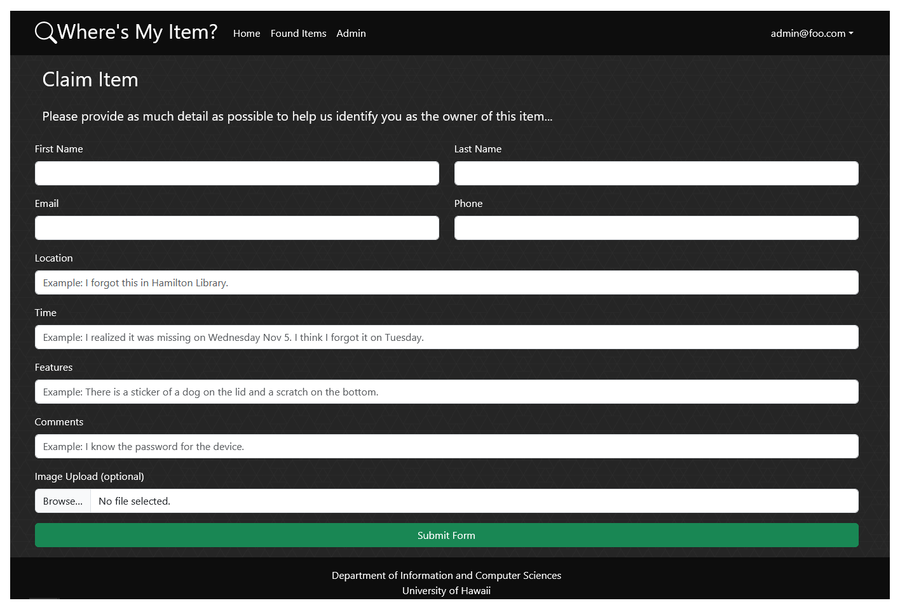
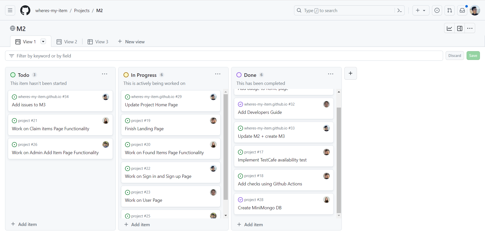

# Where's My Item?

## Table of contents

* [Overview](#overview)
* [Goals](#goals)
* [System](#system)
* [Deployment](#deployment)
* [User Guide](#user-guide)
* [Development History](#development-history)
* [Team](#team)

## Overview

'Where's My Item?' is a site that's designed to allow UH Manoa students to find and report various items that they may have lost on campus.

The site in itself uses:
- Meteor for Javascript-based implementation of client and server code
- React for component-based UI implementation and routing
- React Bootstrap CSS Framework for UI design

The site contains:
- A Landing Page that serves as a home page for users, which provides a description of the functionality of the site to them
- A page that contains a 'Lost Item' form, where users can submit descriptions of items that they've found
  -  This adds to a collection that consists of lost items, including fields with pertinent details such as where it was found, contact details, an image of it, etc.
- A 'Lost Items' database page that contains cards of all the lost items that have been submitted to the database, which users can browse to see if the item they've lost is already there
- A Log-In and Sign-Up page for users to login or create accounts, which is necessary before they can submit items
  - This adds to a collection that consists of user accounts, which have fields for the username, password, whether it has admin priveleges, etc. 
- An admin page where accounts with admin access can view all items that have been submitted and manage them

## Goals

Provide a site for students to report that they’ve lost something, or report an item that they’ve found.

## System

* Page where you can report a missing item
* Picture (if possible)
* Item description
* Name
* Contact information
* Page where you can report you’ve found a lost item
* Picture
* Item description
* Name
* Contact information
* Where it was found
* Login page for UH Manoa student accounts
* Page where you can access all items lost (so you can see if something you’ve lost is there already)
* Edit items
* Option to delete items that you’ve reported/found if returned to owner

## Deployment

We used Digital ocean to deploy our web application.

You can view our deployed application <a href="http://161.35.104.200">here</a>!

## Walkthrough

#### Landing Page

Landing page for users accessing the site without an account:

Provides information regarding the functionality of the site to the user, and prompts them to login/sign up.

#### User login and signup page

A simple mock-up of the login and singup page:

This allows users of the website to create accounts and access user specific information.

#### User (after Login) page, non-Admin user

Once you log in (either to an existing account or by creating a new one), the navbar changes as follows:

You can now access the lost item list and the claim form.

#### Found Items page

Following the navbar link to Found Items will bring you to the page listing all the items that have been found:

The items are listed in cards, with images and details. There is also an option to filter (e.g. by category) and to sort (e.g. by date posted). At the bottom of each item card is a link to claim the item. This link leads to the claim form.

#### Claim Form page

The claim form page can be accessed by clicking the link at the bottom of each item card on the Found Items page.

The claim form page includes the card of the item being claimed. It also has a form for the user to fill in, with their contact information and details about the item. The user can also add a comment. There is also an option to view pending claims.

#### Admin page

The admin page can be accessed after logging in as an admin user, using the navbar.

The page allow you to view all lost items, along with their details. There are two rows of item cards, those with claims and those without claims. Each row is contained in a collapsable container to reduce screen clutter if there are many items.

#### Admin Add/Edit page

The add and edit item pages can be accessed from the admin page. There is a single button to add an item. Each item card has an edit link.

These pages allow the admin to create/edit an item's image, name, location found, and description. The edit page has an aditional button to delete the item in the case that it was mistakenly added or has been returned to the owner.

## Development History

The development process for our website, Where's My Item, conformed to Issue Driven Project Management practices. In short:

* Development consists of a sequence of Milestones.
* Each Milestone is specified as a set of tasks.
* Each task is described using a GitHub Issue, and is assigned to a single developer to complete.
* Tasks should typically consist of work that can be completed in 2-4 days.
* The work for each task is accomplished with a git branch named “issue-XX”, where XX is replaced by the issue number.
* When a task is complete, its corresponding issue is closed and its corresponding git branch is merged into master.
* The state (todo, in progress, complete) of each task for a milestone is managed using a GitHub Project Board.

The following sections document the development history of BowFolios.

### Milestone 1 : Mockups and Initial Page Deployment

Our goal for milestone 1 was to create our home page, with mockups of what our final website should look like, and an initial deployment of our website with a landing page.

Milestone 1 was managed using [BowFolio GitHub Project Board M1](https://github.com/orgs/wheres-my-item/projects/1):

### Milestone 2 : Functionality and Quality

Our goal for milestone 2 was to work on the functionality and quality of our website, specifically making sure each of our pages work as intended.

Milestone 2 was managed using [BowFolio GitHub Project Board M2](https://github.com/orgs/wheres-my-item/projects/3):

## Team

#### Project Team Member:
- Dao McGill       | dmcgill@hawaii.edu   | [GitHub Profile](https://github.com/daomcgill)
- Michael Nakagawa | mnakaga4@hawaii.edu  | [GitHub Profile](https://github.com/mnakagawa14)
- Riki Macmillan   | rikimacm@hawaii.edu  | [GitHub Profile](https://github.com/rikimacmillan)
- Sean Umeda       | sumeda21@hawaii.edu  | [GitHub Profile](https://github.com/Sumeda21)
- Tiffany Ngo      | ngotiff@hawaii.edu   | [GitHub Profile](https://github.com/tiffany-ngo)

Take a look at our <a href="https://docs.google.com/document/d/15k7QCJ0w4ZB97Gaa42dbeFSXAgJNJC7keOgySTGZSys/edit?usp=sharing">team contract</a>.

